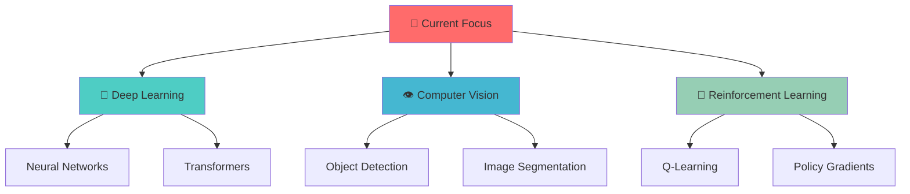

# <div align="center">🌌 **RITESH RAJ** 🌌</div>

<div align="center">


<p align="center">
  
  
  
</p>


</div>

---

##  **About Me**


```javascript
const ritesh = {
    name: "Ritesh Raj",
    location: "Rochester Hills, Michigan 🏡",
    education: "Rochester High School 🎓",
    age: "17",
    currentRole: "Student & Developer",
    
    passions: [
        "🤖 Artificial Intelligence",
        "🔬 Machine Learning", 
        "⚡ Robotics Engineering",
        "🌐 Full-Stack Development"
    ],
    
    currentlyLearning: [
        "Advanced Computer Vision",
        "Reinforcement Learning",
        "Neural Network Architectures"
    ],
    
    goals2024: [
        "Contribute to 10+ Open Source projects",
        "Build an AI-powered robot",
        "Launch my startup idea"
    ],
    
    funFact: "I dream in Python and debug with coffee ☕"
};

console.log("Let's build the future together! 🚀");
```

<br clear="right"/>

---

##  **My Tech Universe**

<div align="center">

### 🔥 **Core Languages**
<p>
  
</p>

### 🌐 **Web Development**
<p>
  
</p>

### 🤖 **AI & Machine Learning**
<p>
  
  
  
  
</p>

### 📱 **Mobile & Cross-Platform**
<p>
  
  
</p>

### ☁️ **Cloud & DevOps**
<p>
  
</p>

### 🗄️ **Databases**
<p>
  
</p>

### 🛠️ **Development Tools**
<p>
  
</p>

</div>

---

##  **GitHub Analytics**

<div align="center">
  
  
</div>

<div align="center">
  
</div>

<div align="center">
  
</div>

---

##  **Showcase Projects**

<div align="center">

<table>
<tr>
<td width="50%">

### 🔥 **Project Pyintel**
[](https://github.com/riteshrajas/project-1)

**Revolutionary IoT Intelligence Hub**

🎯 **What it does:**
- 🤖 AI-powered device orchestration with **Llama 3 7B**
- 🔗 Seamless MQTT protocol communication
- ⚡ Real-time smart home automation
- 📱 Cross-platform control interface

**Tech Stack:** `Python` `MQTT` `AI/ML` `IoT`

</td>
<td width="50%">

### 📚 **Programmer's Handbook**
[](https://github.com/riteshrajas/project-2)

**Ultimate Developer's Bible**

📖 **What it includes:**
- 💻 Complete programming language guides
- 🧠 Data Structures & Algorithms mastery
- 🔍 Advanced search functionality
- 📱 Mobile-responsive design

**Tech Stack:** `Next.js` `Nextra` `Markdown` `TypeScript`

</td>
</tr>
</table>

</div>

---

##  **Achievement Unlocked**

<div align="center">
  
[](https://github.com/ryo-ma/github-profile-trophy)

### 🎯 **2024 Goals Progress**
```
🤖 AI Projects Built        ████████░░ 80%
📚 Open Source Contributions ██████░░░░ 60%  
🚀 Skills Mastered          ███████░░░ 70%
🌟 Community Impact         █████░░░░░ 50%
```

</div>

---

##  **Learning Journey**

<div align="center">



</div>

---

##  **Let's Connect & Collaborate**

<div align="center">

### 🌟 **Ready to Build Something Epic Together?**

<p>
<a href="https://www.linkedin.com/in/riteshrajas/"></a>
<a href="https://twitter.com/riteshrajas"></a>
<a href="https://www.instagram.com/riteshrajas/"></a>
<a href="mailto:code.ritesh@gmail.com"></a>
<a href="https://pyintel.vercel.app"></a>
</p>

### 💭 **Daily Inspiration**


---


### 📈 **This Week I Spent My Time On**
<!--START_SECTION:waka-->
<!--END_SECTION:waka-->

</div>

---

<div align="center">


### 💫 *"Code is not just my profession, it's my passion. Let's create magic together!"*

**🚀 Always open to:**
- 🤝 Collaborating on innovative projects
- 💡 Discussing cutting-edge technology
- 🌟 Mentoring fellow developers
- 🔬 Research opportunities in AI/ML

</div>
