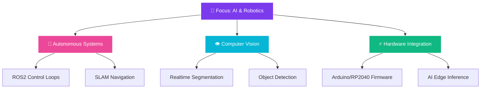

# <div align="center">🌌 **RITESH RAJ** 🌌</div>

<div align="center">


%3B;Building+Autonomous+AI+%26+Robots+%F0%9F%A4%96;Designing+Next-Gen+Automation+%E2%9A%A1;Crafting+Fluent+Windows+Apps+%F0%9F%92%BB)

<p align="center">
  <a href="https://github.com/riteshrajas"></a>
  
  
</p>

</div>

---

<table width="100%">
  <tr>
    <!-- Left Column: Diagnostics, Tech Stack, Roadmap -->
    <td width="55%" valign="top">
      
      <h3>⚡ System Diagnostics</h3>

```typescript
const developer = {
  name: "Ritesh Raj",
  origin: "Rochester Hills, Michigan 🏡",
  status: "Student, Developer, Robotics Architect 🚀",
  
  coreFields: [
    "🤖 Artificial Intelligence & DL",
    "🦾 Autonomous Control (ROS2)",
    "💻 Desktop & Embedded C++",
    "🌐 Next.js & TypeScript"
  ],
  
  currentFocus: [
    "Neural Control Loops & Hardware Integration",
    "Advanced Robot Vision Systems",
    "Fluent 2 Native Desktop Applications"
  ],
  
  diagnostics: "Translating caffeinated beverages into hardware control scripts ☕🔧"
};
```

      <hr />

      <h3>🌌 Tech Stack Universe</h3>
      
      <h4>🤖 Intelligence & Robotics</h4>
      <p>
        
        
        
        
        
        
      </p>

      <h4>💻 Languages & Core</h4>
      <p>
        
      </p>

      <h4>🌐 App Dev & UI</h4>
      <p>
        
      </p>

      <h4>☁️ Platform & Tools</h4>
      <p>
        
      </p>

      <hr />

      <h3>🧠 Learning Roadmap</h3>



    </td>

    <!-- Right Column: Live Metrics, Trophies, Progress -->
    <td width="45%" valign="top">
      
      <h3>📊 Diagnostics & Live Metrics</h3>
      
      <div align="center">
        <!-- GitHub Stats -->
        
        
        <!-- Top Languages -->
        
        
        <!-- Streak Stats -->
        
        
        <!-- Activity Graph -->
        
      </div>

      <hr />

      <h3>🏆 Achievement Unlocked</h3>
      
      <div align="center">
        <!-- Trophies -->
        
      </div>

      <h4>🎯 System Progress</h4>
      <pre>
🤖 AI/Robotics Control   ████████░░ 80%
📚 Open Source Work      ██████░░░░ 60%  
⚡ Embedded Systems       ███████░░░ 70%
🎨 UI/UX Design (Fluent) ████████░░ 80%
      </pre>

    </td>
  </tr>
</table>

---

<h2 align="center">🚀 Showcase Repositories</h2>

<table width="100%">
  <tr>
    <td width="50%" valign="top">
      <h3>🌟 APEX Automation Stack</h3>
      <p align="center">
        <a href="https://github.com/riteshrajas/APEX"></a>
        <a href="https://pyintel.online/"></a>
      </p>
      <p>A multi-module automation stack combining an AI terminal runtime, a real-time web dashboard, embedded firmware, and custom electronics design in a single repository.</p>
      <ul>
        <li>🗣️ Control hardware via natural language CLI</li>
        <li>📈 Real-time workflow visualization on dashboard</li>
        <li>🔌 Direct deployment to Arduino & RP2040 boards</li>
      </ul>
      <p><code>TypeScript</code> <code>C++</code> <code>Arduino</code> <code>WebSockets</code></p>
    </td>
    <td width="50%" valign="top">
      <h3>🎨 FluentFlyout</h3>
      <p align="center">
        <a href="https://github.com/riteshrajas/FluentFlyout"></a>
        <a href="https://fluentflyout.com"></a>
      </p>
      <p>A modern Flyout replacement application for Windows 11 built using Fluent 2 Design principles, modern controls, and taskbar widgets.</p>
      <ul>
        <li>🎛️ Media Flyout & custom volume control sliders</li>
        <li>📅 Interactive taskbar widgets</li>
        <li>⚡ Native performance with modern UI architecture</li>
      </ul>
      <p><code>C#</code> <code>WinUI 3</code> <code>Windows SDK</code> <code>Fluent Design</code></p>
    </td>
  </tr>
  <tr>
    <td width="50%" valign="top">
      <h3>🛠️ Agent-Tools (CLI & MCP)</h3>
      <p align="center">
        <a href="https://github.com/riteshrajas/agent-tools"></a>
      </p>
      <p>A high-performance command line tool and Model Context Protocol (MCP) server for converting media files (video, audio, PDF, etc.) completely locally.</p>
      <ul>
        <li>⚡ Fully bundled CommonJS executable</li>
        <li>📂 Zero-dependency runtime execution</li>
        <li>🏎️ Native binaries packaged for offline execution</li>
      </ul>
      <p><code>TypeScript</code> <code>Node.js</code> <code>esbuild</code> <code>MCP Server</code></p>
    </td>
    <td width="50%" valign="top">
      <h3>🏎️ Autonomous Robotics</h3>
      <p align="center">
        <a href="https://github.com/riteshrajas/AutoDRIVE-RoboRacer-Sim-Racing"></a>
      </p>
      <p>Autonomous racing algorithm implementation utilizing AutoDRIVE simulation platform. Focuses on control theory and computer vision for vehicles.</p>
      <ul>
        <li>🚗 Simulated vehicle physics and sensors</li>
        <li>🎯 Computer vision for lane detection and trajectory planning</li>
        <li>🧠 Integration with ROS2 and ROS nodes</li>
      </ul>
      <p><code>Python</code> <code>ROS2</code> <code>OpenCV</code> <code>Control Theory</code></p>
    </td>
  </tr>
</table>

---

<h2 align="center">🤝 Let's Connect</h2>
<p align="center">
  <a href="https://www.linkedin.com/in/riteshrajas/"></a>
  <a href="https://twitter.com/riteshrajas"></a>
  <a href="https://www.instagram.com/riteshrajas/"></a>
  <a href="mailto:code.ritesh@gmail.com"></a>
  <a href="https://pyintel.online"></a>
</p>

<div align="center">
  <h3>💭 Quote of the Day</h3>
  
  
  <br /><br />
  
  <!-- WakaTime tracking section -->
  <!--START_SECTION:waka-->
  <!--END_SECTION:waka-->
</div>

---

<div align="center">
  
  
  <p><i>"The best way to predict the future is to invent it." — Alan Kay</i></p>
</div>
